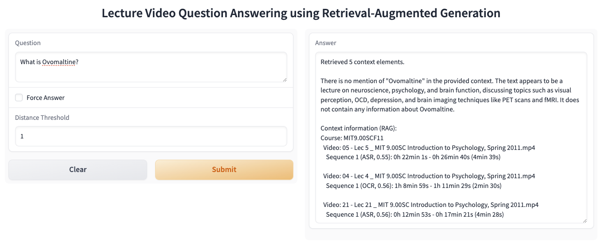

# lecture-video-rag

## Description

This repository holds a lecture video search and question answering system, which is based on retrieval-augmented generation. It is also the artifact of my master's thesis and the paper "Enhancing Question Answering in Lecture Videos with a Multimodal Retrieval-Augmented Generation Framework", which was accepted at AIMSA 2024.

## Code Organization

- `src` contains the RAG logic.
- `dev` contains a Jupyter notebook that uses logic in `src` and demonstrates a simple use case. It also contains the `qa-dataset.py` file which was used as question answering dataset for the research project, as well as the hyperparameters we found to be optimal for our dataset.

## Development Setup

1. Ensure you have the package manager pdm installed: https://pdm-project.org/en/latest/ (on MacOS: `brew install pdm`)
2. Optional: If you want to use tesseract as OCR library, instead of the default easyocr, install the necessary tesseract system dependencies (see below)
3. Ensure Python 3.11 is installed (with pdm: `pdm python install 3.11`)
4. Follow Llama-CPP-Python instructions (see below)
5. Run `pdm install -d` to install all dependencies
6. Rename the `example.env` file in the `dev` folder to `.env` and fill in the necessary environment variables
7. Run the code in `dev/rag_example.ipynb` to see how to use the RAG logic

### Tesseract System Dependencies (Optional)

- Tesseract: https://github.com/tesseract-ocr/tesseract?tab=readme-ov-file#installing-tesseract
- ffmpeg: https://ffmpeg.org/download.html

### Llama-CPP-Python (Optional - if used with CUDA or macOS M-family GPU)

- In case your system has a CUDA compatible GPU: `CUDACXX=/usr/local/cuda-12/bin/nvcc CMAKE_ARGS="-DLLAMA_CUBLAS=on -DCMAKE_CUDA_ARCHITECTURES=all-major" FORCE_CMAKE=1` before `pdm install` (https://medium.com/@ryan.stewart113/a-simple-guide-to-enabling-cuda-gpu-support-for-llama-cpp-python-on-your-os-or-in-containers-8b5ec1f912a4)
- In case you have a macOS M-family GPU (supporting MPS): `CMAKE_ARGS="-DLLAMA_METAL=on"` before `pdm install`

### Useful Commands

- Watch CUDA GPU processes: `watch -n 1 nvidia-smi`
- Watch CPU processes: `htop`

## Gradio Screenshot

